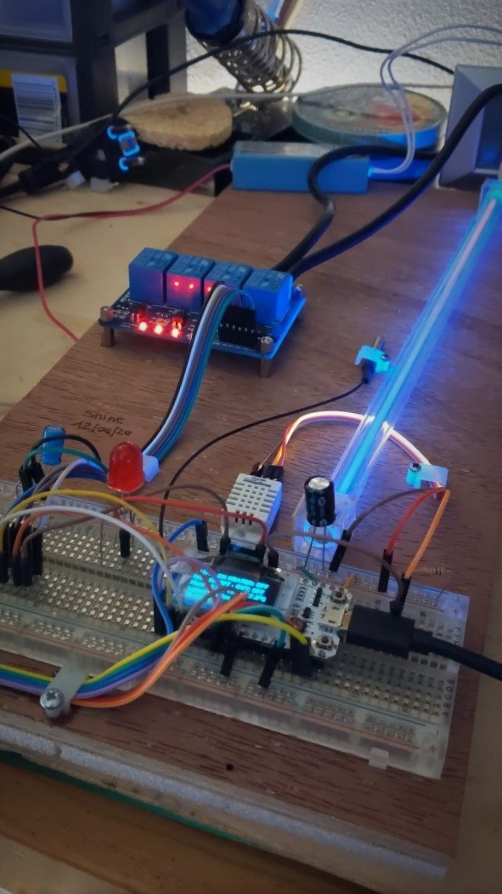

# Minigrowl-ESP-LoRa32-OLED
minimal firmware w/ JSON test processing to drive a growroom. The project is made of three part, this is the device driver. It is designed to operate a main light at predetermined time and take some specific actions if air is too dry and/or hot. It reports sensors state to a spring server and download a list of commands to be executed. Please see [Microgrowl-spring](https://shineangelic.github.io/Minigrowl-spring/) for general concepts and [Microgrowl-react](https://github.com/shineangelic/Minigrowl-react) for a working client example.

It works looping over chamber logic, sensors readings and JSON communications with a server (optional, for now), thanks to [Arduino JSON](https://arduinojson.org/). A sketch is provided as an example of how I am configuring my own device.

The project implements in C++ a similar entity structure found at upper level of abstraction: `Sensors`, `Actuators` and `Commands`.  Even though this is an arguable design choice, it was made to exploit Objects potentiality even at lower abstraction level. Considering that this project's target board The Haltec WiFi OLED is very cheap but offer much juice, I felt guilty not to use dynamic JSON objects and other memory-expensive stuff.

# Required Hardware


* ESP32 board with OLED (optional, actually)
* DHT22 temperature sensor (optional, used for external room temp)
* BME280 main chamber pressure, temperature and humidity sensor
* a photoresistor
* 4 relay board, to operate devices 


the `minigrowl.ino` sketch is made to compile on a ESP32 WiFi LoRa device, but should be easily compiled on other ESP32 devices.
Here is an example PIN usage. You will need a DHT22 (temperature sensor), a photoresistor and BMS280 (temperature) to run the code as-is.

This is how I set them:

```
// WIFI_LoRa_32 OLED ports
//OLED_SDA -- GPIO4
//OLED_SCL -- GPIO15
//OLED_RST -- GPIO16

// WIFI_LoRa_32 ports
GPIO5  -- SX1278's SCK
GPIO19 -- SX1278's MISO
GPIO27 -- SX1278's MOSI
GPIO18 -- SX1278's CS
GPIO14 -- SX1278's RESET
GPIO26 -- SX1278's IRQ(Interrupt Request)

GPIO12 MAIN_LIGHTS 12
#define HEATER		25//onboardLED
#define OUTTAKE_FAN	13
#define INTAKE_FAN	2
#define OLED		16

//BME280 temperature sensor
#define SCL 17
#define SDA 21
//photoresistor
#define LIGHT_SENSOR 33
#define DHTPIN 22 
#define ERRPIN 23//error LED
```


## Operations
The board will periodically send its status to a spring-boot server via WiFi, and download a list of commands to be executed. Both sensors and actuators are sent periodically, with a decreasing interval until `MAX_SLEEP` time. Intervals can be set in 

### NTP

NTP is being used to retrieve local time, show it on OLED screen and execute commands at the right time

### Chamber.cpp

This is the class representing real hardware. It `has-a` pointer to devices and actuators

### GrowlManager.cpp

Main ESP32 software controller. It `has-a` chamber and communicates via JSON to exchange devices and control them. Implements a basic _lifecycle loop_, trying to keep values inside a preferred range:

  * The out-take `Fan` will be switched on when internal temperature exceeds 29 degrees, and shut-off above 27
  * The `MainLights` switch is temporized for a 20/4 daily cycle. Anothe timetable is predefined for flowering phase



## Used libraries

 * https://github.com/beegee-tokyo/DHTesp
 * https://arduinojson.org/
 * https://github.com/adafruit/Adafruit_BME280_Library

## warning
please note that is an amateur past-time work. Do not use it in professional environments

